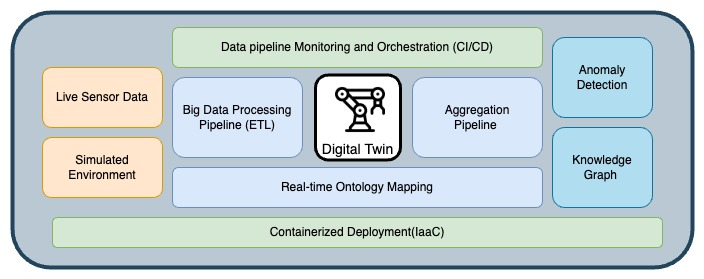
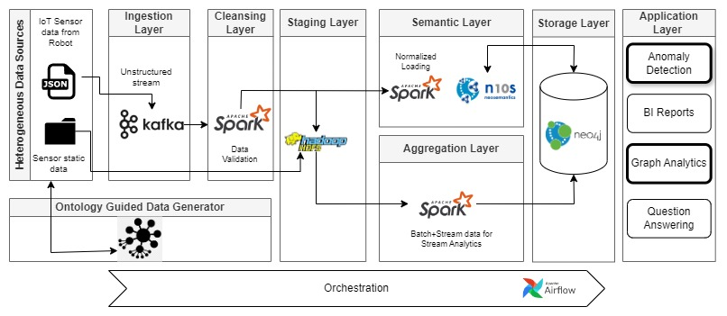
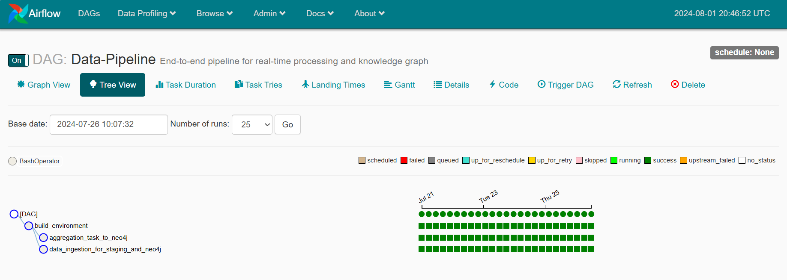
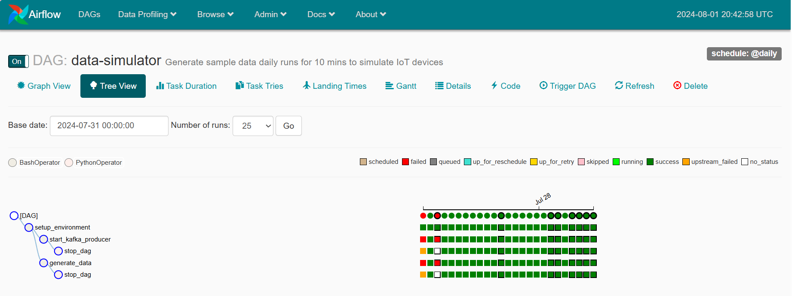

# Real-Time Knowledge Streams in Semantic Digital Twin Systems

## Overview

This project presents the implementation of a near real-time data pipeline that supports industrial process monitoring and anomaly detection. The system leverages various big data tools and graph database technology to offer real-time insights into industrial activities. It is designed with scalability and cross-domain data sharing in mind, following RDF standards and using a custom ontology to ensure interoperability.


## Features

- **Real-Time Monitoring:** The pipeline includes a dynamic dashboard for continuous monitoring and visualization of potential threats and anomalies.
- **Anomaly Detection:** The system implements advanced anomaly detection algorithms to identify irregularities in robotic arm movements during industrial processes.
- **RDF-Based Data Management:** The data pipeline uses RDF standards to ensure data consistency, context-aware processing, and interoperability across different systems.
- **Modular Design:** The architecture is modular, enabling easy integration of various industrial components and cross-domain data sources.
- **Comparative Study:** The project includes a comparative analysis of various tools used for data ingestion, processing, and visualization, helping users make informed decisions on tool selection.



## Project Structure

- `/scripts`: Source code for the data pipeline, anomaly detection algorithms, and monitoring dashboard.
- `/ontology`: RDF schema and ontology definitions used for structuring data.
- `/config`: Configuration files for different tools used in the project (e.g., Kafka, Spark, Neo4j).
- `/dags`: Airflow dags scripts are specified with their dependencies.
- `/images`: Image of the docker container for easy deployment

## Tools and Technologies

- **Apache Kafka**: For real-time data ingestion and streaming.
- **Apache Spark**: For distributed data processing and analytics.
- **Neo4j**: For managing and querying data in a graph-based format using RDF standards, runs on desktop.
- **Docker**: For containerizing the application components to ensure easy deployment.
- **Apache Airflow**: For Data monitoring and CI/CD of the pipeline


## Quickstart

The easiest way to understand the setup is by diving into it and interacting with it.

### Running Docker Compose

To run Docker Compose, simply execute the following command in the current folder:

```bash
docker-compose up -d
```
This will start all 4 containers in detached mode.

To view their status, run:

```bash
docker-compose ps
```
Example output:

```bash

NAME        IMAGE                                COMMAND                  SERVICE     CREATED          STATUS         PORTS
----------------------------------------------------------------------------------------------------------------------------------------
kafka1      wurstmeister/kafka:2.12-2.2.0        "start-kafka.sh"         kafka1      15 minutes ago   Up 3 seconds   8080/tcp, 9092/tcp
kafka2      wurstmeister/kafka:2.12-2.2.0        "start-kafka.sh"         kafka2      15 minutes ago   Up 3 seconds   8080/tcp, 9092/tcp
spark       gettyimages/spark:2.4.1-hadoop-3.0   "bin/spark-class org…"   spark       15 minutes ago   Up 4 seconds
zookeeper   zookeeper:3.6.1                      "/docker-entrypoint.…"   zookeeper   15 minutes ago   Up 4 seconds   2181/tcp, 2888/tcp, 3888/tcp, 8080/tcp
```
To view the logs, run:

```bash

docker-compose logs -f -t --tail=10 <container_name>
```
To check memory and CPU usage:

```bash
docker stats
```
Opening Shell Into Container
To open a shell inside the Spark container, use the following command:

```bash
docker-compose exec spark bash
```
The current working directory is mounted in the /app folder inside the Spark container, allowing you to modify any files in the repo's folder and have them appear inside the container.

Running Sample Code
There are two sample scripts included to test publishing data to a Kafka topic and reading it with Spark.

### Publishing Data
Inside the repository, there is a sample script that publishes numbers from 1 to 1000 to a topic named SAMPLE_TOPIC_NAME. The script can be found in create_topic_send_data.py.

To run it, follow these steps:

Open a shell inside the Spark container (assuming containers are already running):

```bash
docker-compose exec spark bash
```
Start the PostGreSQL service:

```bash
sudo service postgresql start
```
Install the required Python dependencies:

```bash
cd /app
source env/bin/activate
export AIRFLOW_HOME=/app
export AIRFLOW__CORE__EXECUTOR=LocalExecutor
airflow db init
airflow webserver -p 8082
```
In a new terminal window, start the Airflow scheduler:

```bash
docker-compose exec spark bash
source /app/env/bin/activate
cd /app
airflow scheduler
```
Access the Airflow UI at http://localhost:8082 in your browser to view and manage DAGs.

#### Airflow Setup and Triggering DAGs
To interact with Airflow and trigger DAGs via the UI, follow these steps:

Access the Spark container:

```bash
docker-compose exec spark bash
```
Start the Airflow webserver: Inside the container, activate the environment and start the webserver:

```bash
source env/bin/activate
export AIRFLOW_HOME=/app
export AIRFLOW__CORE__EXECUTOR=LocalExecutor
airflow webserver -p 8082
```
Start the Airflow scheduler: In a new terminal window:

```bash
docker-compose exec spark bash
source env/bin/activate
cd /app
airflow scheduler
```
Access the Airflow UI: Open your browser and go to http://localhost:8082 to access the Airflow UI.

### Trigger DAGs:

Inside the Airflow UI, you will see a list of available DAGs.
Click the "Trigger" button next to the desired DAG to start it.
Monitor execution, view logs, and inspect DAG runs via the UI.

